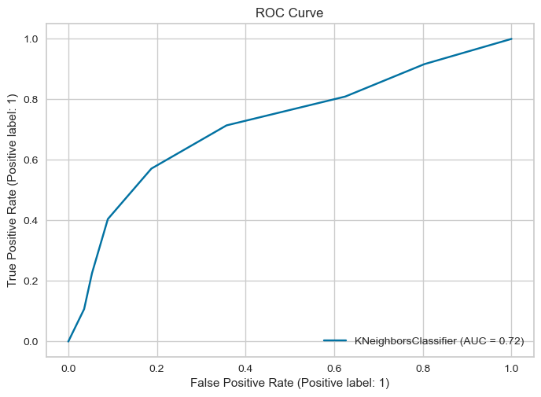
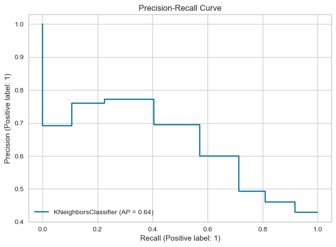

# Flagging Bad Loans

This project aims to analyze loan data and identify risky customers, marked by a binary "bad flag." It explores multiple features related to customer payment behavior, demographics, and loan performance to predict default risks.

---

## Table of Contents
- [Dataset Description](#dataset-description)  
- [Project Workflow](#project-workflow)  
- [Usage](#usage)  
- [Features](#features)  
- [Algorithms](#algorithms)  
- [Evaluation Metrics](#evaluation-metrics)  
- [Results](#results)  
- [Conclusion](#conclusion)  

---

## Dataset Description  
The dataset consists of **4,157 entries** and **22 columns** representing various aspects of loans and customer behavior. Below are some key features:  

- **loanKey**: Unique identifier for each loan.  
- **dpd_5_cnt**, **dpd_15_cnt**, **dpd_30_cnt**: Number of times the payment was 5, 15, or 30 days past due.  
- **score_1** & **score_2**: Credit scores (with `score_2` containing missing data).  
- **age**: Customer’s age.  
- **gender**: Customer’s gender (Boolean: True/False).  
- **bad_flag**: Target variable indicating if a customer is risky (1) or not (0).  

### **Summary of Missing Data:**  
- Overdue-related fields are available for only 16.2% of entries.  
- Second credit score (`score_2`) is present for only 5.7% of entries.  

---

## Project Workflow  
1. **Feature Engineering**  
   - Calculated date differences between events.  
   - Encoded categorical variables, e.g., gender (`True → 1`, `False → 0`).  
   - Used **one-hot encoding** for federal regions with `pandas.get_dummies()`.  

2. **Exploratory Data Analysis (EDA)**  
   - Analyzed distributions of customer attributes.  
   - Explored correlations between overdue history and loan defaults.

3. **Model Training**  
   - Trained various machine learning models to predict `bad_flag`.  
   - Tested and validated performance on unseen data.

---

## Usage  
- **Loan Default Prediction**: Predict whether a customer will default based on payment history, credit scores, and demographics.  
- **Credit Risk Analysis**: Assess customer risk profiles using overdue counts and credit scores.  
- **Customer Segmentation**: Group customers by demographics and payment patterns for targeted actions.

---

## Algorithms  
We evaluated the following algorithms:

1. **SGDClassifier**  
2. **KNeighborsClassifier**  
3. **LogisticRegression**  
4. **LogisticRegressionCV**  
5. **BaggingClassifier**  
6. **GaussianNB**  
7. **RandomForestClassifier**  
8. **ExtraTreesClassifier**

---

## Evaluation Metrics  
### **Ideal Metric: F1-Score or Precision-Recall Tradeoff**  
- Both **precision** and **recall** are crucial for predicting loan defaults.  
- **F1-score**—the harmonic mean of precision and recall—acts as a key evaluation metric.  
- A **precision-recall curve** helps visualize the tradeoff between precision and recall, assisting in selecting the best threshold.

### **Conclusion**  
- **Recall** is prioritized to catch as many potential defaulters as possible, minimizing financial risks.  
- **Precision** helps limit false positives, preserving customer trust and avoiding unnecessary actions.  
- An **ideal model** balances **high recall** and **reasonable precision** to mitigate risks while promoting business growth.

---

## Results  

### **1. Unsampled Data**  
Below are the F1-scores for models trained on the original dataset:

| **Algorithm**            | **F1-Score**              |
|--------------------------|---------------------------|
| SGDClassifier            | 0.2384                    |
| KNeighborsClassifier     | 0.2018                    |
| LogisticRegression       | 0.0652                    |
| LogisticRegressionCV     | 0.0444                    |
| BaggingClassifier        | 0.1261                    |
| GaussianNB               | 0.2246                    |
| RandomForestClassifier   | 0.1633                    |
| ExtraTreesClassifier     | 0.1553                    |

---

### **2. Undersampled Data**  
Below are the F1-scores after **undersampling** to handle class imbalance:

| **Algorithm**            | **F1-Score**              |
|--------------------------|---------------------------|
| SGDClassifier            | 0.5627                    |
| KNeighborsClassifier     | 0.5882                    |
| LogisticRegression       | 0.5139                    |
| LogisticRegressionCV     | 0.6309                    |
| BaggingClassifier        | 0.6027                    |
| GaussianNB               | 0.5110                    |
| RandomForestClassifier   | 0.6452                    |
| ExtraTreesClassifier     | 0.6452                    |

---

### **3. ROC Curve**  
The **ROC curve** provides a visual comparison of the models' ability to distinguish between good and bad loans.  

---

### **4. Precision-Recall Curve**  
The **Precision-Recall curve** highlights the tradeoff between precision and recall, guiding optimal threshold selection.  

---

## Conclusion  
- **Undersampling** significantly improved model performance, especially for **RandomForestClassifier** and **ExtraTreesClassifier**.  
- These two algorithms achieved the highest **F1-scores** (0.645), striking an effective balance between **recall** and **precision**.  
- Such models are ideal for real-world loan default prediction, helping mitigate risks while minimizing false positives to ensure smooth operations.
